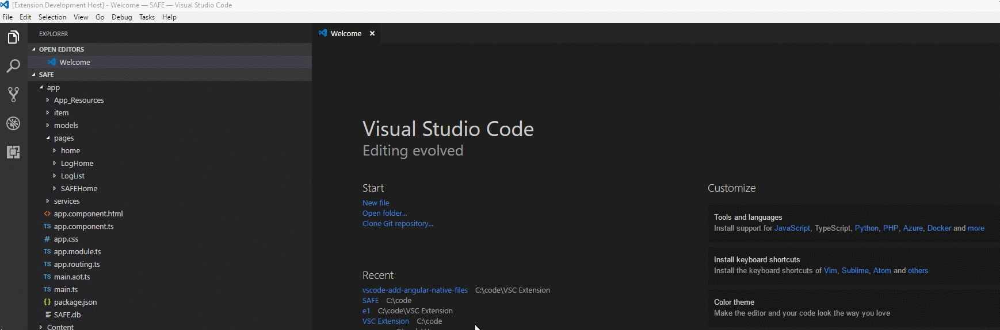

# vscode-nativescript-generator

This extension allows you to add easily add boilerplate Nativescript/Angular files to your Visual Studio Code project

> Based on code from from[Sebastian Baar](https://github.com/sebastianbaar/vscode-add-angular2-files) VS Code Add Angular2 Files 
> and [Josh Sommer](https://github.com/TheOriginalJosh/vscode-add-angular-native-files) vscode-add-angular-native-files

## Changelog

## 0.0.1

## Features

Right click on a file or a folder in your current project. In the context menu is the option to generate a native script page

### generate a native script page

This command adds the following files to your new folder (let's assume you typed in `home`):
```
home/home.component.ts
home/home.component.html
home/home.component.css
```



# Disclaimer

**Important:** This extension due to the nature of it's purpose will create
files on your hard drive and if necessary create the respective folder structure.
While it should not override any files during this process, I'm not giving any guarantees
or take any responsibility in case of lost data.

# License

MIT
"# vscode-nativescript-generator" 
